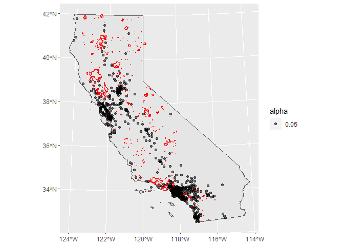
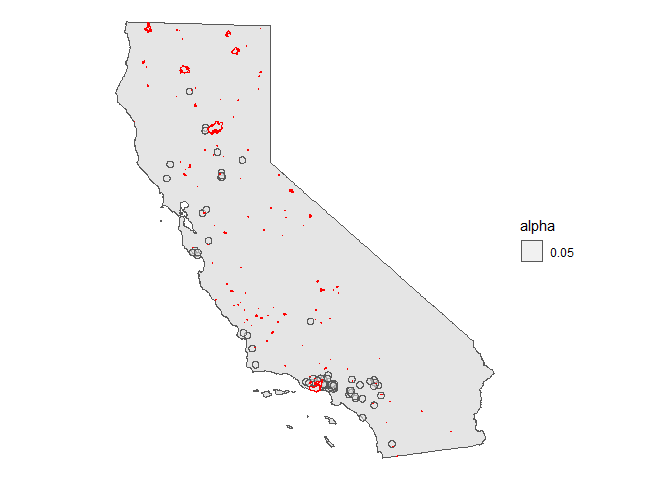

Fires Itersecting Zipcodes at 3, 5, 10 Miles Radii
================
Angela Zhao
2020-07-03

  - [Notes:](#notes)
      - [Troubleshooting st\_intersects and st\_crs w/
        buffer](#troubleshooting-st_intersects-and-st_crs-w-buffer)
  - [Reading in wildfires data](#reading-in-wildfires-data)
  - [Data Wrangling](#data-wrangling)
      - [Reading in Zipcode Data](#reading-in-zipcode-data)
      - [Plotting zipcodes onto the
        map](#plotting-zipcodes-onto-the-map)
      - [Plotting CA and Zipcodes on a
        map](#plotting-ca-and-zipcodes-on-a-map)
      - [Plotting fires on top of zipcode
        centroids](#plotting-fires-on-top-of-zipcode-centroids)
      - [Created a tidy tibble of zipcodes, geometry, centroid,
        buffer\_radius, and buffer
        geometry](#created-a-tidy-tibble-of-zipcodes-geometry-centroid-buffer_radius-and-buffer-geometry)
      - [Running fire\_intersect using map\_dfr and
        functions](#running-fire_intersect-using-map_dfr-and-functions)
      - [Reading the finished, tidied tibble into a data
        set](#reading-the-finished-tidied-tibble-into-a-data-set)
  - [Presenting of various graphs](#presenting-of-various-graphs)
      - [Graphing the frequency of fires in a certain radius around
        zipcode](#graphing-the-frequency-of-fires-in-a-certain-radius-around-zipcode)
      - [Counting distances and numbers of fires experienced over the
        years](#counting-distances-and-numbers-of-fires-experienced-over-the-years)
      - [Mapping out areas that experienced
        fire](#mapping-out-areas-that-experienced-fire)

``` r
# Libraries
library(tidyverse)
library(sf)
library(ussf)
library(zipcode)
library(lubridate)
library(haven)


# Parameters
file_raw_survey <- here::here("data/STAN0128_main_OUTPUT.rds")

file_zipcodes_ca_geometry <-
  here::here("data/ca_zipcodes/ca_zipcodes.shp")

file_raw_fire_perim <- 
  here::here("data/frap_fire_perim_firep19_1_shp/firep19_1.shp")

file_out_num_fires_intersect <-
  here::here(
    "data/num_fires_intersect_zipcodes/num_fires_intersect_zipcodes.shp"
  )

# PROJ string for CA
CA_ALBERS <- 
  "+proj=aea +lat_1=34 +lat_2=40.5 +lat_0=0 +lon_0=-120 +x_0=0 +y_0=-4000000 +ellps=WGS84 +datum=WGS84 +units=m +no_defs"

CA_ALBERS_EPSG <- 3310
```

## Notes:

num\_fires\_intersect: final tibble with all the good stuff in it.
Contains zipcodes, geoid, geometry of the zipcodes, and number of fires
3, 5, 10 miles away from 2017-2019 and 2018-2019.

### Troubleshooting st\_intersects and st\_crs w/ buffer

Used CA\_ALBERS\_ESPG as opposed to CA\_ALBERS because the projection
wasn’t sticking to the buffer otherwise.

So gdb files contain multisurface and is a limitation not of sf but of
GEOS. This means that st\_intersects refuses to work with multisurface
and gives off the error: Error in CPL\_geos\_binop(st\_geometry(x),
st\_geometry(y), op, par, pattern, : Evaluation error: ParseException:
Unknown WKB type 12.

Code given: st\_intersects(test\(buffer_shape, test\)fire\_geometry) Two
paths: either turn it into a multipolygon and hope that the multisurface
goes away, or import the layer of interest in the gdb as a shapefile.
Consider “test” as a df. How to find if multisurface:
unique(st\_geometry\_type(st\_geometry(test\(fire_geometry or foo)))  To cast to a different shape: st_cast(test\)fire\_geometry,
“POLYGON”) To change st\_intersect result, an sgbp, into vector: a \<-
st\_intersects(test\(buffer_shape, test\)fire\_geometry) sel\_logical =
lengths(a) \> 0

## Reading in wildfires data

``` r
# Function for reading in wildfires

read_wildfires <- function() {
  file_raw_fire_perim %>% 
    read_sf() %>% 
    rename_all(tolower) %>% 
    rename(
      geometry_length = shape_leng,
      geometry_area = shape_area,
      year = year_
    ) %>% 
    mutate(
      alarm_date = as.Date(alarm_date),
      cont_date = as.Date(cont_date), 
      id = row_number()
    ) %>%
    select(
      fire_name, 
      alarm_date, 
      cont_date, 
      gis_acres,
      geometry_length, 
      geometry_area, 
      geometry
    )
}

wildfires_2017_19 <-
  read_wildfires() %>% 
  filter(alarm_date >= "2017/08/15" & alarm_date <= "2019/08/15") 
 

wildfires_2018_19 <-
  read_wildfires() %>% 
  filter(alarm_date >= "2018/08/15" & alarm_date <= "2019/08/15")
```

# Data Wrangling

## Reading in Zipcode Data

``` r
data(zipcode)

zipcodes_ca <-
  zipcode %>% 
  filter(state == "CA") %>% 
  distinct(zip)

zipcodes_survey_ca <-
  file_raw_survey %>% 
  read_dta() %>% 
  mutate_if(is.labelled, as_factor) %>%
  rename(zip = inputzip) %>% 
  filter(str_detect(consent, "Yes"), zip %in% zipcodes_ca$zip) %>% 
  distinct(zip)
```

## Plotting zipcodes onto the map

``` r
# From the zipcode package

create_buffer <- function(data, radius) {
  data %>% 
  st_buffer(units::set_units(radius, "miles")) %>% 
    st_transform(crs = CA_ALBERS) %>% 
    st_transform(CA_ALBERS_EPSG)
}

# These are the zipcodes that are in CA and found in the survey. They also have centroid, general zipcode polygon, and buffer data. 
zipcodes_ca_geometry <-
  file_zipcodes_ca_geometry %>% 
  read_sf() %>% 
  rename(zipcode = name) %>% 
  filter(zipcode %in% zipcodes_survey_ca$zip) %>% 
  st_transform(crs = CA_ALBERS) %>% 
  rename(
    zipcode_geometry = geometry
  ) %>% 
  mutate(
    zipcode_centroid = st_centroid(zipcode_geometry),
    "3_mile_buffer" = create_buffer(zipcode_centroid, 3), 
    "5_mile_buffer" = create_buffer(zipcode_centroid, 5),
    "10_mile_buffer" = create_buffer(zipcode_centroid, 10)
  ) %>% 
  select(-c(B00001001, B00001001e))

# st_crs(zipcodes_ca_geometry$`10_mile_buffer`)
```

## Plotting CA and Zipcodes on a map

``` r
ca <- 
  boundaries(geography = "state", resolution = "500k", projection = "albers") %>% 
  filter(NAME == "California") %>% 
  st_transform(crs = CA_ALBERS) 


plot_zipcodes <- function(data) {
  ca %>% 
  ggplot() +
  geom_sf() +
  geom_sf(aes(alpha = 0.05), data = data) +
  theme_void()
}

# Plotting zipcodes as district boundaries

plot_zipcodes(zipcodes_ca_geometry) 
```

<!-- -->

``` r
# Plotting zipcode centroid points

plot_zipcodes(zipcodes_ca_geometry$zipcode_centroid) 
```

<!-- -->

``` r
# Plotting zipcodes in 3, 5, and 10 mile radii 

plot_zipcodes(zipcodes_ca_geometry$`3_mile_buffer`)
```

<!-- -->

``` r
plot_zipcodes(zipcodes_ca_geometry$`5_mile_buffer`)
```

<!-- -->

``` r
plot_zipcodes(zipcodes_ca_geometry$`10_mile_buffer`)
```

<!-- -->

## Plotting fires on top of zipcode centroids

``` r
# Use the geometry to identify which column's geometry within the tibble to use. 

ggplot() +
  geom_sf(data = ca) + 
  geom_sf(
    aes(
      geometry = zipcode_centroid, 
      alpha = 0.05
    ), 
    data = zipcodes_ca_geometry, 
    show.legend = "point"
  ) + 
  geom_sf(data = wildfires_2018_19, color = "red")
```

<!-- -->

``` r
ggplot() +
  geom_sf(data = ca) + 
  geom_sf(
    aes(
      geometry = zipcode_centroid, 
      alpha = 0.05
    ), 
    data = zipcodes_ca_geometry, 
    show.legend = "point"
  ) + 
  geom_sf(data = wildfires_2017_19, color = "red")
```

<!-- -->
\#\# Looking at overlaps between zip code buffers of 3, 5, 10 miles from
geometry of fires

## Created a tidy tibble of zipcodes, geometry, centroid, buffer\_radius, and buffer geometry

``` r
zipcodes_fires_ca <-
  zipcodes_ca_geometry %>% 
  pivot_longer(
    cols = c("3_mile_buffer":"10_mile_buffer"), 
    names_to = "buffer_radius(miles)", 
    values_to = "buffer_shape"
  ) %>% 
  mutate(
    "buffer_radius(miles)" = 
      str_extract(`buffer_radius(miles)`, "\\d+") %>% as.double(), 
    zipcode_centroid = st_transform(zipcode_centroid, CA_ALBERS)
  )
```

    ## Warning in val_cols[col_id] <- unname(as.list(data[cols])): number of items to
    ## replace is not a multiple of replacement length

``` r
st_crs(zipcodes_fires_ca$zipcode_centroid) <- CA_ALBERS_EPSG
```

    ## Warning: st_crs<- : replacing crs does not reproject data; use st_transform for
    ## that

## Running fire\_intersect using map\_dfr and functions

``` r
fires_intersect_buffer_2017_2019 <- function(buffer_shape) {
    st_intersects(buffer_shape, wildfires_2017_19$geometry, sparse = FALSE) %>% 
    sum()
}

fires_intersect_buffer_2018_2019 <- function(buffer_shape) {
    st_intersects(buffer_shape, wildfires_2018_19$geometry, sparse = FALSE) %>% 
    sum()
}

## The function safely() returns a nested tibble with one column results and the other error. Due to reliance on unnesting, safely() is not used. 

zipcodes_fires_ca <-
  zipcodes_fires_ca %>% 
  mutate(
    num_fires_2017_2019 = map(buffer_shape, fires_intersect_buffer_2017_2019), 
    num_fires_2018_2019 = map(buffer_shape, fires_intersect_buffer_2018_2019)
  )  %>% 
  unnest(cols = c(num_fires_2017_2019, num_fires_2018_2019))

# Old code. Inefficient and not guaranteed to be accurate. 
# tibble_fires_intersect_buffer_2017_2019 <-
#   zipcodes_fires_ca %>% 
#   pull(buffer_shape) %>% 
#   map_dfr(safely(fires_intersect_buffer_2017_2019)) %>% 
#   rename(num_fires_2017_2019 = result)
# 
# tibble_fires_intersect_buffer_2018_2019 <-
#   zipcodes_fires_ca %>% 
#   pull(buffer_shape) %>% 
#   map_dfr(safely(fires_intersect_buffer_2018_2019)) %>% 
#   rename(num_fires_2018_2019 = result)
# 
# 
# zipcodes_fires_ca <-
#   zipcodes_fires_ca %>% 
#   bind_cols(tibble_fires_intersect_buffer_2017_2019) %>% 
#   bind_cols(tibble_fires_intersect_buffer_2018_2019) 
```

## Reading the finished, tidied tibble into a data set

``` r
zipcodes_fires_ca %>% 
  rename(
    "2018-2019" = "num_fires_2018_2019", 
    "2017-2019" = "num_fires_2017_2019"
  ) %>% 
  rename(
    'zipcode_radius(miles)' = `buffer_radius(miles)`, 
    zipcode_buffer_shape = buffer_shape
  ) %>% 
  pivot_longer(
    names_to = "years", 
    values_to = "num_fires_intersect", 
    cols = c("2018-2019", "2017-2019")
  ) %>% 
  select(-zipcode_centroid, -zipcode_buffer_shape) %>% 
  write_sf(file_out_num_fires_intersect)
```

    ## Warning in abbreviate_shapefile_names(obj): Field names abbreviated for ESRI
    ## Shapefile driver

# Presenting of various graphs

## Graphing the frequency of fires in a certain radius around zipcode

``` r
graph_freq_fires_radius <- function(rad) {
  zipcodes_fires_ca %>% 
  filter(`buffer_radius(miles)` == {{rad}}) %>% 
  select(starts_with("num")) %>% 
  rename(
    "2018-2019" = "num_fires_2018_2019", 
    "2017-2019" = "num_fires_2017_2019"
  ) %>% 
  pivot_longer(
    names_to = "years", 
    values_to = "num", 
    cols = c("2018-2019", "2017-2019")
  ) %>% 
  count(years, num) %>% 
  ggplot(aes(x = num, y = n, fill = years)) +
  geom_col(position = "dodge") +
  labs(
    x = str_c("Number of fires within ", rad, " miles of zipcode"), 
    y = "Frequency in CA"
  )
}


map(c(3, 5, 10), graph_freq_fires_radius)
```

    ## [[1]]

<!-- -->

    ## 
    ## [[2]]

<!-- -->

    ## 
    ## [[3]]

<!-- -->

## Counting distances and numbers of fires experienced over the years

``` r
zipcodes_fires_ca %>% 
  filter(num_fires_2018_2019 > 0, num_fires_2017_2019 > 0) %>% 
  rename(
    "2018-2019" = "num_fires_2018_2019", 
    "2017-2019" = "num_fires_2017_2019"
  ) %>% 
  pivot_longer(
    names_to = "years", 
    values_to = "num", 
    cols = c("2018-2019", "2017-2019")
  ) %>% 
  count(`buffer_radius(miles)`, years)
```

    ## # A tibble: 6 x 3
    ##   `buffer_radius(miles)` years         n
    ##                    <dbl> <chr>     <int>
    ## 1                      3 2017-2019    32
    ## 2                      3 2018-2019    32
    ## 3                      5 2017-2019    71
    ## 4                      5 2018-2019    71
    ## 5                     10 2017-2019   254
    ## 6                     10 2018-2019   254

## Mapping out areas that experienced fire

``` r
plot_zipcodes_filter_2017 <- function(rad) {
  data <-
    zipcodes_fires_ca %>% 
    filter(
      num_fires_2017_2019 > 0, 
      `buffer_radius(miles)` == rad
    ) %>% 
    distinct(zipcode, buffer_shape) %>% 
    pull(buffer_shape)
  

  ca %>% 
    ggplot() +
    geom_sf() +
    geom_sf(aes(alpha = 0.05), data = data) +
    geom_sf(data = wildfires_2018_19, color = "red") + 
    theme_void()
}


plot_zipcodes_filter_2018 <- function(rad) {
  data <-
    zipcodes_fires_ca %>% 
    filter(
      num_fires_2018_2019 > 0,
      `buffer_radius(miles)` == rad
    ) %>% 
    distinct(zipcode, buffer_shape) %>% 
    pull(buffer_shape)
  
  ca %>% 
    ggplot() +
    geom_sf() +
    geom_sf(aes(alpha = 0.05), data = data) +
    geom_sf(data = wildfires_2018_19, color = "red") +
    theme_void()
}

 ca %>% 
    ggplot() +
    geom_sf() +
    geom_sf(data = wildfires_2018_19, color = "red") + 
    theme_void()
```

<!-- -->

``` r
  ca %>% 
    ggplot() +
    geom_sf() +
    geom_sf(data = wildfires_2017_19, color = "red") + 
    theme_void()
```

<!-- -->

``` r
map(c(3, 5, 10), plot_zipcodes_filter_2017)
```

    ## [[1]]

<!-- -->

    ## 
    ## [[2]]

<!-- -->

    ## 
    ## [[3]]

<!-- -->

``` r
map(c(3, 5, 10), plot_zipcodes_filter_2018)
```

    ## [[1]]

<!-- -->

    ## 
    ## [[2]]

<!-- -->

    ## 
    ## [[3]]

<!-- -->
