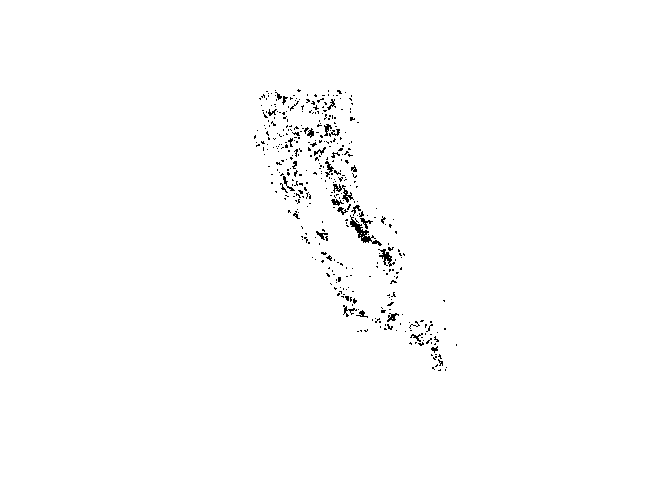

frap\_fire\_perimeter
================
Angela Zhao
2020-06-23

  - [Reading in Fire Perimeter Data](#reading-in-fire-perimeter-data)
  - [Wrangling Wildfire Data](#wrangling-wildfire-data)

``` r
# Libraries
library(tidyverse)
library(sf)

# Parameters
file_raw <- here::here("data-raw/frap_fire_perimeter_gis.gdb")

file_perim <- 
  here::here("data/ca_fire_perimeters_shp/California_Fire_Perimeters.shp")
```

## Reading in Fire Perimeter Data

``` r
layers <-
  file_raw %>% 
  st_layers()

read_sf_layers <- function(name) {
  file_raw %>% 
    read_sf(layer = name)
}

map(layers$name, read_sf_layers)
```

    ## Warning in CPL_read_ogr(dsn, layer, query, as.character(options), quiet, :
    ## GDAL Message 1: organizePolygons() received a polygon with more than 100 parts.
    ## The processing may be really slow. You can skip the processing by setting
    ## METHOD=SKIP, or only make it analyze counter-clock wise parts by setting
    ## METHOD=ONLY_CCW if you can assume that the outline of holes is counter-clock
    ## wise defined

    ## [[1]]
    ## Simple feature collection with 864 features and 16 fields
    ## geometry type:  GEOMETRY
    ## dimension:      XY
    ## bbox:           xmin: -360921.6 ymin: -587308.9 xmax: 386027.6 ymax: 452118.5
    ## projected CRS:  NAD83 / California Albers
    ## # A tibble: 864 x 17
    ##    TREATMENT_ID TREATMENT_NAME TREATMENT_TYPE UNIT_ID AGENCY TREATED_AC
    ##    <chr>        <chr>                   <int> <chr>   <chr>       <dbl>
    ##  1 3277604      NON_WUI                    13 SQF     USF        136.  
    ##  2 3277608      NON_WUI                    15 SQF     USF        292.  
    ##  3 3277612      SOUTHRIDGE 1-~              5 BDF     USF          4.73
    ##  4 3277613      SOUTHRIDGE UN~              9 BDF     USF         22.7 
    ##  5 3277840      HIGHWAY 20 CU~              9 TNF     USF        106.  
    ##  6 3266945      NON_WUI                     9 SQF     USF        300.  
    ##  7 3266963      DEFENSE_THREAT              9 SQF     USF         74.4 
    ##  8 3266967      DEFENSE_THREAT              5 SQF     USF        105.  
    ##  9 3268764      TORO DFPZ GRA~             13 TNF     USF        184.  
    ## 10 3268765      TORO DFPZ GRA~             13 TNF     USF        629.  
    ## # ... with 854 more rows, and 11 more variables: GIS_ACRES <dbl>, STATE <chr>,
    ## #   YEAR_ <chr>, RX_CONSUM <int>, PRE_CON_CLASS <int>, POST_CON_CLASS <int>,
    ## #   Shape_Length <dbl>, Shape_Area <dbl>, END_DATE <dttm>, START_DATE <dttm>,
    ## #   Shape <MULTIPOLYGON [m]>
    ## 
    ## [[2]]
    ## Simple feature collection with 20820 features and 17 fields
    ## geometry type:  GEOMETRY
    ## dimension:      XY
    ## bbox:           xmin: -373237.5 ymin: -604727.6 xmax: 519987.8 ymax: 518283.7
    ## projected CRS:  NAD83 / California Albers
    ## # A tibble: 20,820 x 18
    ##    YEAR_ STATE AGENCY UNIT_ID FIRE_NAME INC_NUM ALARM_DATE         
    ##    <chr> <chr> <chr>  <chr>   <chr>     <chr>   <dttm>             
    ##  1 2007  CA    CCO    LAC     OCTOBER   002463~ 2007-10-21 00:00:00
    ##  2 2007  CA    CCO    LAC     MAGIC     002330~ 2007-10-22 00:00:00
    ##  3 2007  CA    USF    ANF     RANCH     000001~ 2007-10-20 00:00:00
    ##  4 2007  CA    CCO    LAC     EMMA      002013~ 2007-09-11 00:00:00
    ##  5 2007  CA    CCO    LAC     CORRAL    002594~ 2007-11-24 00:00:00
    ##  6 2007  CA    CCO    LAC     GORMAN    001093~ 2007-05-19 00:00:00
    ##  7 2007  CA    CCO    LAC     WEST      001483~ 2007-07-07 00:00:00
    ##  8 2007  CA    CCO    LAC     PEARBLOS~ 001774~ 2007-08-13 00:00:00
    ##  9 2007  CA    CCO    LAC     SKYLINE   001836~ 2007-08-21 00:00:00
    ## 10 2007  CA    CCO    LAC     SESNON    002318~ 2007-10-21 00:00:00
    ## # ... with 20,810 more rows, and 11 more variables: CONT_DATE <dttm>,
    ## #   CAUSE <int>, COMMENTS <chr>, REPORT_AC <dbl>, GIS_ACRES <dbl>,
    ## #   C_METHOD <int>, OBJECTIVE <int>, FIRE_NUM <chr>, Shape_Length <dbl>,
    ## #   Shape_Area <dbl>, Shape <MULTIPOLYGON [m]>
    ## 
    ## [[3]]
    ## Simple feature collection with 6118 features and 16 fields
    ## geometry type:  GEOMETRY
    ## dimension:      XY
    ## bbox:           xmin: -373246.9 ymin: -597860.1 xmax: 351529.9 ymax: 447814.6
    ## projected CRS:  NAD83 / California Albers
    ## # A tibble: 6,118 x 17
    ##    YEAR_ STATE AGENCY UNIT_ID TREATMENT_ID TREATMENT_NAME TREATMENT_TYPE
    ##    <chr> <chr> <chr>  <chr>   <chr>        <chr>                   <int>
    ##  1 2017  CA    CDF    BEU     7515         LAMACCHIA NOR~             NA
    ##  2 2017  CA    CDF    LNU     7044         UNIT 3                     NA
    ##  3 2017  CA    CDF    TCU     6682         WINVMP-5-BROA~              3
    ##  4 2017  CA    CDF    TUU     6741         HERBERT BURN                7
    ##  5 2017  CA    CDF    RRU     6547         COLORADO NORT~             NA
    ##  6 2017  CA    CDF    SLU     7824         BURN PLOT 3                NA
    ##  7 2017  CA    CDF    TCU     6721         SARBB-JANUARY~             NA
    ##  8 2017  CA    CDF    SCU     6889         VALLEY BURN J~              7
    ##  9 2017  CA    CDF    FKU     7293         2017 BROADCAS~              3
    ## 10 2017  CA    CDF    SLU     7822         BURN PLOT 1                NA
    ## # ... with 6,108 more rows, and 10 more variables: START_DATE <dttm>,
    ## #   END_DATE <dttm>, TREATED_AC <dbl>, GIS_ACRES <dbl>, RX_CONSUM <int>,
    ## #   PRE_CON_CLASS <int>, POST_CON_CLASS <int>, Shape_Length <dbl>,
    ## #   Shape_Area <dbl>, Shape <MULTIPOLYGON [m]>

## Wrangling Wildfire Data

``` r
wildfires_2018_19 <-
  file_raw %>% 
  read_sf(layer = "firep19_1") %>% 
  rename_all(tolower) %>% 
  filter(alarm_date >= "2018-08-15", year_ %in% c("2018","2019"))

wildfires_2017_19 <-
  file_raw %>% 
  read_sf(layer = "firep19_1") %>% 
  rename_all(tolower) %>% 
  filter(alarm_date >= "2017-08-15", year_ %in% c("2018","2019"))

# plot(wildfires$shape)
```

``` r
ca <-
  file_perim %>% 
  read_sf()

plot(ca$geometry)
```

<!-- -->
